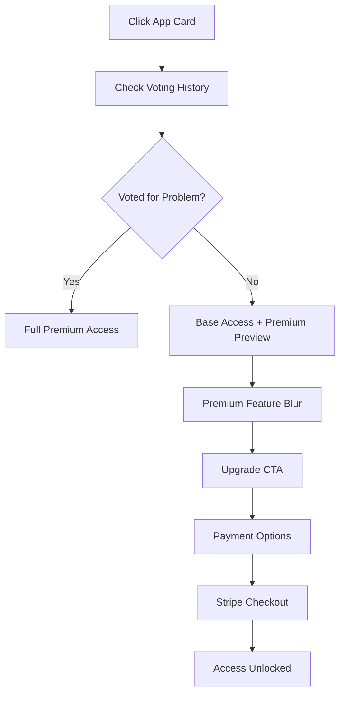

# WikiGaiaLab UI/UX Specification

## Introduction

This document defines the user experience goals, information architecture, user flows, and visual design specifications for WikiGaiaLab's user interface. It serves as the foundation for visual design and frontend development, ensuring a cohesive and user-centered experience.

### Overall UX Goals & Principles

#### Target User Personas

**Community Members:** Non-technical users who want to propose problems and vote on solutions they care about. They value simplicity, clear communication, and feeling heard by the community.

**Active Contributors:** Engaged users who regularly propose problems and vote. They need efficient workflows, progress tracking, and recognition for their participation.

**Solution Consumers:** Users who primarily use the developed apps. They want easy access to premium features and clear value from their community participation.

**Administrators:** Team members who moderate content, manage problems, and monitor platform health. They need comprehensive tools and clear oversight capabilities.

#### Usability Goals

- **Immediate comprehension:** New users understand the concept within 30 seconds of landing
- **Effortless participation:** Voting takes one click with immediate visual feedback
- **Intuitive problem submission:** Proposing problems feels natural and guided
- **Clear value proposition:** Users understand how voting unlocks premium features
- **Accessible to all:** Italian interface with WCAG AA compliance for inclusive participation

#### Design Principles

1. **Semplicità Elegante** - Clean, uncluttered interfaces that make complex community dynamics feel simple
2. **Immediatezza Visiva** - Real-time feedback and visual changes that make every interaction satisfying
3. **Coinvolgimento Emotivo** - Design that creates emotional connection to community problems and solutions
4. **Accessibilità Universale** - Inclusive design that welcomes all members of the community
5. **Crescita Guidata** - Progressive disclosure that helps users discover more advanced features naturally

### Change Log

| Date | Version | Description | Author |
|------|---------|-------------|--------|
| 17/07/2025 | 1.0 | Initial UI/UX specification | Sally (UX Expert) |

## Information Architecture (IA)

### Site Map / Screen Inventory

```mermaid
graph TD
    A[Homepage] --> B[Dashboard Utente]
    A --> C[Dashboard Problemi]
    A --> D[Catalogo App]
    A --> E[Profilo Utente]
    A --> F[Login/Registrazione]
    
    B --> B1[Statistiche Personali]
    B --> B2[Attività Recente]
    B --> B3[Azioni Rapide]
    
    C --> C1[Proponi Problema]
    C --> C2[Dettaglio Problema]
    C --> C3[Filtri e Ricerca]
    
    D --> D1[Pagina App Specifica]
    D --> D2[Accesso Premium]
    D --> D3[Volantino Generator]
    
    E --> E1[I Miei Problemi]
    E --> E2[I Miei Voti]
    E --> E3[Le Mie App]
    E --> E4[Impostazioni]
    
    G[Admin Dashboard] --> G1[Gestione Problemi]
    G[Admin Dashboard] --> G2[Gestione Utenti]
    G[Admin Dashboard] --> G3[Statistiche Piattaforma]
    G[Admin Dashboard] --> G4[Configurazione]
```



### Navigation Structure

**Primary Navigation:** Fixed header with WikiGaiaLab logo, main sections (Problemi, Le Mie App, Profilo), and user menu

**Secondary Navigation:** Contextual sidebar filters in problem dashboard, breadcrumbs in problem detail pages, category tabs in app catalog

**Breadcrumb Strategy:** Clear path indication for nested content, especially problem categories and app sections

## User Flows

### Flow 1: New User Onboarding

**User Goal:** Understand WikiGaiaLab concept and make first vote

**Entry Points:** Homepage, social media links, word-of-mouth referrals

**Success Criteria:** User completes registration and casts first vote within 5 minutes

#### Flow Diagram

```mermaid
graph TD
    A[Land on Homepage] --> B[Click "Entra"]
    B --> C[Google OAuth Login]
    C --> D[Dashboard Problemi]
    D --> E[Browse Problems]
    E --> F[Click Heart to Vote]
    F --> G[Success Animation]
    G --> H[Real-time Counter Update]
    H --> I[Discover More Problems]
```

#### Edge Cases & Error Handling:
- OAuth failure ’ Clear error message with retry option
- No problems visible ’ Welcome message with explanation
- Double-click on vote ’ Prevent with disabled state
- Network error ’ Offline indicator with retry

**Notes:** Critical that first vote experience is delightful and creates immediate engagement

### Flow 2: Problem Proposal

**User Goal:** Submit new problem for community voting

**Entry Points:** Dashboard CTA, user profile, direct navigation

**Success Criteria:** Problem published with clear confirmation and tracking info

#### Flow Diagram

```mermaid
graph TD
    A[Click "Proponi Problema"] --> B[Form Page]
    B --> C[Fill Required Fields]
    C --> D[Select Category]
    D --> E[Preview Problem]
    E --> F[Submit]
    F --> G[Validation]
    G --> H[Success Page]
    H --> I[Auto-vote for Own Problem]
    I --> J[Share Options]
```

#### Edge Cases & Error Handling:
- Validation errors ’ Inline messages with clear guidance
- Duplicate detection ’ Suggest similar problems
- Save draft ’ Auto-save with recovery option
- Category unclear ’ Help text with examples

**Notes:** Form should feel conversational, not bureaucratic

### Flow 3: App Access and Premium Features

**User Goal:** Access premium features in developed apps

**Entry Points:** App catalog, problem success notification, profile dashboard

**Success Criteria:** User accesses premium features or understands upgrade path

#### Flow Diagram



#### Edge Cases & Error Handling:
- Payment failure ’ Clear error with retry options
- Voting history unclear ’ Detailed explanation
- Premium preview ’ Engaging teasers without frustration
- Subscription management ’ Clear control panel

**Notes:** Premium gates should motivate, not frustrate

## Wireframes & Mockups

**Primary Design Files:** To be created in Figma after specification approval

### Key Screen Layouts

#### Homepage/Landing
**Purpose:** Explain WikiGaiaLab concept and drive registration

**Key Elements:**
- Hero section with clear value proposition
- Problem preview cards showing voting in action
- Social proof (community size, problems solved)
- Clear CTA for registration

**Interaction Notes:** Animated voting counters to show real-time engagement

#### Dashboard Problemi
**Purpose:** Primary interface for discovering and voting on problems

**Key Elements:**
- Filter/search bar with category dropdown
- Problem cards with voting buttons
- Sort options (popularity, recent, category)
- "Proponi Problema" floating action button

**Interaction Notes:** Smooth card animations, immediate vote feedback, infinite scroll

#### Dettaglio Problema
**Purpose:** Full problem information and social sharing

**Key Elements:**
- Complete problem description with formatting
- Vote button with current count
- Social sharing buttons
- Related problems suggestions

**Interaction Notes:** Share animations, vote confirmation, responsive layout

## Component Library / Design System

**Design System Approach:** Custom design system built on Tailwind CSS with Italian-focused components

### Core Components

#### Vote Button
**Purpose:** Primary interaction for community engagement

**Variants:** Default, Voted, Disabled, Loading

**States:** Idle, Hover, Active, Disabled

**Usage Guidelines:** Always visible, consistent positioning, immediate feedback

#### Problem Card
**Purpose:** Display problem information in card format

**Variants:** Compact, Expanded, Featured

**States:** Default, Hover, Loading, Error

**Usage Guidelines:** Consistent spacing, clear hierarchy, responsive behavior

#### Premium Gate
**Purpose:** Control access to premium features

**Variants:** Soft gate (preview), Hard gate (blocked), Upgrade prompt

**States:** Locked, Unlocked, Loading, Error

**Usage Guidelines:** Clear value communication, non-frustrating experience

## Branding & Style Guide

### Visual Identity
**Brand Guidelines:** Combining Ass.Gaia sustainability with Ecologicaleaving innovation

### Color Palette

| Color Type | Hex Code | Usage |
|------------|----------|-------|
| Primary | #2D5A27 | Main actions, voted states, primary buttons |
| Secondary | #6B8E23 | Secondary actions, category badges |
| Accent | #32CD32 | Success states, growth indicators |
| Success | #28A745 | Confirmations, positive feedback |
| Warning | #FFC107 | Important notices, threshold warnings |
| Error | #DC3545 | Errors, destructive actions |
| Neutral | #6C757D, #F8F9FA | Text, borders, backgrounds |

### Typography

#### Font Families
- **Primary:** Inter (clean, modern, excellent Italian character support)
- **Secondary:** Roboto (backup, Google Fonts reliability)
- **Monospace:** JetBrains Mono (code blocks, technical content)

#### Type Scale

| Element | Size | Weight | Line Height |
|---------|------|--------|-------------|
| H1 | 2.5rem | 700 | 1.2 |
| H2 | 2rem | 600 | 1.3 |
| H3 | 1.5rem | 600 | 1.4 |
| Body | 1rem | 400 | 1.6 |
| Small | 0.875rem | 400 | 1.5 |

### Iconography
**Icon Library:** Lucide React (consistent style, excellent coverage)

**Usage Guidelines:** 24px standard size, consistent stroke width, semantic color usage

### Spacing & Layout
**Grid System:** 12-column CSS Grid with 24px gutters

**Spacing Scale:** 4px base unit (4, 8, 12, 16, 24, 32, 48, 64, 96px)

## Accessibility Requirements

### Compliance Target
**Standard:** WCAG AA (Web Content Accessibility Guidelines 2.1 AA)

### Key Requirements

**Visual:**
- Color contrast ratios: 4.5:1 for normal text, 3:1 for large text
- Focus indicators: 2px solid outline with high contrast
- Text sizing: Minimum 16px, scalable to 200% without horizontal scrolling

**Interaction:**
- Keyboard navigation: All interactive elements accessible via keyboard
- Screen reader support: Proper ARIA labels and semantic HTML
- Touch targets: Minimum 44px x 44px for mobile interactions

**Content:**
- Alternative text: Descriptive alt text for all images and icons
- Heading structure: Logical heading hierarchy (H1-H6)
- Form labels: Clear labels and error messages for all form fields

### Testing Strategy
Manual keyboard navigation testing, screen reader testing with NVDA/JAWS, color contrast verification, mobile accessibility testing

## Responsiveness Strategy

### Breakpoints

| Breakpoint | Min Width | Max Width | Target Devices |
|------------|-----------|-----------|----------------|
| Mobile | 320px | 767px | Smartphones |
| Tablet | 768px | 1023px | Tablets, small laptops |
| Desktop | 1024px | 1439px | Desktop computers |
| Wide | 1440px | - | Large monitors |

### Adaptation Patterns

**Layout Changes:** Single column mobile ’ multi-column desktop, collapsible sidebar navigation

**Navigation Changes:** Hamburger menu mobile ’ horizontal nav desktop, tab bar mobile ’ dropdown desktop

**Content Priority:** Hide secondary information on mobile, progressive disclosure patterns

**Interaction Changes:** Touch-optimized buttons mobile ’ hover states desktop, swipe gestures mobile ’ click desktop

## Animation & Micro-interactions

### Motion Principles
Animations should feel natural and purposeful, enhancing usability rather than adding decoration. Use ease-out timing for UI elements, keep duration under 300ms for micro-interactions.

### Key Animations
- **Vote Button:** Scale + color change on click (200ms, ease-out)
- **Problem Card:** Gentle hover lift (150ms, ease-out)
- **Vote Counter:** Number increment with bounce (300ms, ease-out)
- **Page Transitions:** Subtle fade (200ms, ease-in-out)
- **Loading States:** Gentle pulse for skeleton screens (1000ms, ease-in-out)

## Performance Considerations

### Performance Goals
- **Page Load:** Under 3 seconds on 3G connection
- **Interaction Response:** Under 100ms for button feedback
- **Animation FPS:** Consistent 60fps for all animations

### Design Strategies
Optimize images with WebP format, use CSS animations over JavaScript, implement lazy loading for problem cards, progressive loading for app catalog, minimal JavaScript for core voting functionality.

## Next Steps

### Immediate Actions
1. Review specification with team for feedback and approval
2. Create detailed visual designs in Figma
3. Prepare component specifications for developer handoff
4. Conduct user testing on key flows
5. Finalize accessibility requirements with development team

### Design Handoff Checklist
- [x] All user flows documented
- [x] Component inventory complete
- [x] Accessibility requirements defined
- [x] Responsive strategy clear
- [x] Brand guidelines incorporated
- [x] Performance goals established

## Checklist Results

_This section will be populated after running the UI/UX specification checklist_