# WikiGaiaLab - Specifica della Bottega Digitale
*L'officina di quartiere dove l'AI aiuta la comunità*

## Benvenuti nella Nostra Bottega

Questo documento descrive come trasformare WikiGaiaLab in una bottega digitale accogliente dove ogni vicino di casa può portare i propri problemi quotidiani e trovare aiuto dalla comunità. Come in una vera bottega artigiana, qui il maestro (l'AI) mette i suoi strumenti al servizio delle persone semplici, creando un ambiente dove tutti si sentono a casa.

### La Filosofia della Nostra Bottega

#### Chi Frequenta la Nostra Bottega

**La Mamma del Quartiere (Maria, 42 anni):** Organizza eventi per la scuola, coordina i gruppi WhatsApp del condominio, ha sempre mille cose da fare ma poca confidenza con la tecnologia. Viene in bottega quando ha bisogno di aiuto per organizzare la festa di compleanno di suo figlio o creare un volantino per il mercatino.

**Il Pensionato Curioso (Giuseppe, 67 anni):** Ex operaio, ora dedica tempo al volontariato e ai suoi hobby. Sa usare il telefono ma non si fida dei "computer complicati". In bottega trova un ambiente familiare dove può chiedere aiuto per digitalizzare le foto del circolo o organizzare le attività dell'orto condiviso.

**La Studentessa Impegnata (Sofia, 23 anni):** Studia e lavora part-time, organizza eventi per l'associazione studentesca. È tecnologica ma non ha tempo per imparare strumenti complessi. Viene in bottega per soluzioni rapide: creare sondaggi, gestire liste partecipanti, automatizzare cose noiose.

**Il Vicino di Casa Generoso (Marco, 35 anni):** Papà che lavora da casa, sempre disponibile ad aiutare i vicini. Non è un tecnico ma sa arrangiarsi. In bottega condivide i suoi piccoli problemi risolti e aiuta altri genitori con questioni simili.

**Il Maestro Artigiano (Sistema AI):** L'intelligenza artificiale della bottega, presentata come un vecchio artigiano saggio che conosce tutti i trucchi del mestiere. Non è un robot freddo, ma un mentore paziente che guida ogni persona verso la soluzione giusta per lei.

#### Come Vogliamo che si Sentano i Nostri Ospiti

- **"Mi sento a casa":** Chi entra per la prima volta capisce subito che questo è un posto sicuro dove può chiedere aiuto senza giudizi
- **"Posso farcela anch'io":** Anche chi non è pratico di tecnologia riesce a esprimere il suo sostegno con un semplice gesto
- **"Finalmente qualcuno mi capisce":** Raccontare il proprio problema quotidiano è semplice come parlare con un vicino di casa
- **"Ecco cosa ci guadagno":** È chiaro che aiutando gli altri, ricevo aiuto anch'io - come in una vera comunità di quartiere
- **"Tutti sono benvenuti":** L'ambiente è inclusivo e parla la lingua del cuore, accessibile a ogni tipo di persona

#### I Principi della Nostra Bottega

1. **Calore Artigianale** - Ogni schermata accoglie come l'ingresso di una bottega familiare, dove ogni dettaglio è pensato per far sentire a proprio agio
2. **Gesti che Parlano** - Ogni click, ogni tocco risponde immediatamente come quando il maestro artigiano annuisce alle tue parole
3. **Cuore di Quartiere** - I problemi quotidiani delle persone diventano il centro dell'esperienza, come le chiacchiere al banco della bottega
4. **Porte Sempre Aperte** - Nonna, studente, mamma, pensionato: tutti trovano il loro posto e il loro modo di partecipare
5. **Maestria Paziente** - Come un vero artigiano insegna gradualmente, così l'interfaccia svela le sue possibilità passo dopo passo

### Change Log

| Date | Version | Description | Author |
|------|---------|-------------|--------|
| 17/07/2025 | 1.0 | Initial UI/UX specification | Sally (UX Expert) |

## La Mappa della Nostra Bottega
*Come è organizzato il nostro spazio di lavoro comunitario*

### Gli Spazi della Bottega

```mermaid
graph TD
    A["🏠 L'Ingresso<br/>(Homepage)"] --> B["👤 Il Mio Angolo<br/>(Dashboard Personale)"]
    A --> C["💬 La Bacheca dei Problemi<br/>(Stanza delle Richieste)"]
    A --> D["🔧 Gli Strumenti del Maestro<br/>(Catalogo Soluzioni)"]
    A --> E["📋 Il Mio Quaderno<br/>(Profilo Personale)"]
    A --> F["🚪 Porta d'Ingresso<br/>(Registrazione)"]
    
    B --> B1["📊 I Miei Contributi"]
    B --> B2["📰 Ultime Novità"]
    B --> B3["⚡ Aiuto Veloce"]
    
    C --> C1["✍️ Racconta il Tuo Problema"]
    C --> C2["📖 Storia Completa"]
    C --> C3["🔍 Trova quello che Cerchi"]
    
    D --> D1["🛠️ Strumento Specifico"]
    D --> D2["⭐ Accesso Speciale"]
    D --> D3["📄 Crea Volantini"]
    
    E --> E1["❓ I Miei Problemi"]
    E --> E2["❤️ I Miei Sostegni"]
    E --> E3["🔧 I Miei Strumenti"]
    E --> E4["⚙️ Preferenze"]
    
    G["👨‍🔧 Banco del Maestro<br/>(Area Amministrativa)"] --> G1["📝 Cura dei Problemi"]
    G["👨‍🔧 Banco del Maestro<br/>(Area Amministrativa)"] --> G2["👥 Cura della Comunità"]
    G["👨‍🔧 Banco del Maestro<br/>(Area Amministrativa)"] --> G3["📈 Salute della Bottega"]
    G["👨‍🔧 Banco del Maestro<br/>(Area Amministrativa)"] --> G4["🔧 Strumenti del Mestiere"]
```

### Come ci si Muove nella Bottega

**Il Banco Principale:** Una mensola sempre visibile con il nome della bottega, gli spazi principali (La Bacheca, I Miei Strumenti, Il Mio Quaderno) e il saluto personale

**Le Indicazioni del Maestro:** Suggerimenti contestuali che appaiono quando ne hai bisogno, come cartellini che spiegano dove trovare cosa, etichette sui cassetti degli strumenti

**Il Filo d'Arianna:** Tracce chiare di dove sei stato, soprattutto quando esplori i problemi per categoria o scopri nuovi strumenti, come le briciole di pane nelle fiabe

## I Percorsi nella Bottega
*Come accompagniamo ogni persona nel suo viaggio*

### Percorso 1: Il Primo Giorno di Bottega

**Il Desiderio:** Capire se questo posto può davvero aiutarmi con i miei problemi quotidiani

**Come Arrivano:** Un vicino ne ha parlato, hanno visto un post sui social, o hanno sentito parlare al bar del quartiere

**Il Successo:** La persona si sente accolta, capisce come funziona e dà il suo primo sostegno a un problema che le sta a cuore

#### Il Viaggio Passo per Passo

```mermaid
graph TD
    A["🏠 Busso alla Porta<br/>(Arrivo sulla Homepage)"] --> B["🙋 'Ciao, posso entrare?'<br/>(Click Entra)"]
    B --> C["🔑 Mi Presento<br/>(Login con Google)"]
    C --> D["👀 Guardo in Giro<br/>(Vedo la Bacheca)"]
    D --> E["📚 Leggo le Storie<br/>(Scopro i Problemi)"]
    E --> F["❤️ 'Anch'io la penso così!'<br/>(Do il Mio Cuore)"]
    F --> G["✨ Il Maestro Sorride<br/>(Animazione di Ringraziamento)"]
    G --> H["📊 Vedo Crescere l'Interesse<br/>(Contatore che Sale)"]
    H --> I["🔍 'Cosa altro posso aiutare?'<br/>(Scopro Altri Problemi)"]
```

#### Quando le Cose Non Vanno Come Previsto:
- **Il Maestro non mi riconosce** (Login fallito) – "Ops, proviamo di nuovo insieme. Magari è solo la connessione che fa i capricci."
- **La bacheca è vuota** – "Benvenuto! Sei tra i primi ad arrivare. Che bello avere pionieri come te!"
- **Clicco due volte per l'emozione** – Il sistema capisce e non conta doppio: "Ho già sentito il tuo cuore!"
- **Internet va e viene** – "Sembra che ci siano problemi di connessione. Il maestro aspetta pazientemente."

**L'Anima del Momento:** Il primo sostegno deve essere magico, come quando da bambini ricevevi il primo "bravo" dal nonno

### Percorso 2: Racconto il Mio Problema

**Il Desiderio:** Ho un problema quotidiano e voglio vedere se anche altri lo sentono come me

**Come Inizia:** Vedo il pulsante "Racconta", dalla mia pagina personale, o perché un amico mi ha detto "dovresti proprio proporlo lì"

**Il Successo:** Il mio problema è pubblicato, altri possono vederlo, e io posso seguire chi lo sostiene

#### Il Mio Viaggio per Raccontare

```mermaid
graph TD
    A["💬 'Ho un problema!'<br/>(Click Racconta)"] --> B["📋 Il Quaderno del Maestro<br/>(Pagina del Racconto)"]
    B --> C["✍️ Scrivo la Mia Storia<br/>(Compilo i Campi)"]
    C --> D["🟷️ 'Di che tipo è?'<br/>(Scelgo la Categoria)"]
    D --> E["👀 'Ecco come si vedrà'<br/>(Anteprima)"]
    E --> F["🚀 'Condividi con Tutti!'<br/>(Invio)"]
    F --> G["🔍 Il Maestro Controlla<br/>(Validazione)"]
    G --> H["🎉 'Benvenuto nella Bacheca!'<br/>(Pagina di Successo)"]
    H --> I["❤️ Il Primo Cuore<br/>(Voto Automatico)"]
    I --> J["📢 'Dillo agli Amici!'<br/>(Opzioni Condivisione)"]
```

#### Edge Cases & Error Handling:
- Validation errors � Inline messages with clear guidance
- Duplicate detection � Suggest similar problems
- Save draft � Auto-save with recovery option
- Category unclear � Help text with examples

**Notes:** Form should feel conversational, not bureaucratic

### Percorso 3: Uso gli Strumenti del Maestro

**Il Desiderio:** Voglio usare gli strumenti che la bottega ha creato per risolvere i problemi come il mio

**Come Inizia:** Vedo gli strumenti disponibili, ricevo una notifica che qualcosa è pronto, o li scopro nella mia pagina personale

**Il Successo:** Riesco ad usare lo strumento che mi serve, oppure capisco cosa devo fare per ottenerlo

#### Il Percorso verso gli Strumenti

```mermaid
graph TD
    A["🔧 'Questo mi serve!'<br/>(Click sullo Strumento)"] --> B["📋 Il Maestro Controlla<br/>(Verifica Partecipazione)"]
    B --> C{"❤️ Hai Sostenuto<br/>questo Problema?"}
    C -->|"Sì!"| D["🎉 Strumento Completo<br/>(Accesso Pieno)"]
    C -->|"Non Ancora"| E["👀 Assaggio Gratuito<br/>(Anteprima)"]
    E --> F["🌫️ Velo Misterioso<br/>(Funzioni Nascoste)"]
    F --> G["💫 'Vuoi Tutto?'<br/>(Proposta di Accesso)"]
    G --> H["💳 'Come Preferisci Pagare?'<br/>(Opzioni di Pagamento)"]
    H --> I["🛍️ Cassa Sicura<br/>(Pagamento Stripe)"]
    I --> J["🗝 Strumento Sbloccato<br/>(Accesso Garantito)"]
```

#### Edge Cases & Error Handling:
- Payment failure � Clear error with retry options
- Voting history unclear � Detailed explanation
- Premium preview � Engaging teasers without frustration
- Subscription management � Clear control panel

**Notes:** Premium gates should motivate, not frustrate

## Gli Schizzi della Bottega
*Come immaginamo ogni angolo del nostro spazio*

**I Disegni del Progetto:** Saranno creati con amore in Figma dopo che avremo tutti approvato questa visione

### Gli Spazi Principali della Bottega

#### 🏠 L'Ingresso della Bottega
**Cosa Vogliamo:** Che chi entra si senta subito a casa e capisca che qui può essere aiutato

**Gli Elementi del Benvenuto:**
- Un caloroso "Benvenuto nella bottega del quartiere" che spiega subito chi siamo
- Esempi di problemi reali con i cuoricini che si muovono, per mostrare la vita della comunità
- "Siamo già in 1.247 vicini che si aiutano" - numeri che danno fiducia
- Un invito chiaro: "Entra anche tu nella nostra famiglia"

**La Magia dell'Accoglienza:** I contatori dei sostegni si muovono dolcemente, come il respiro della comunità viva

#### 💬 La Bacheca dei Problemi
**Cosa Vogliamo:** Che tutti si sentano come quando guardano la bacheca del circolo o del condominio

**Gli Elementi della Condivisione:**
- Una barra di ricerca amichevole: "Cosa stai cercando?" con suggerimenti dolci
- Cartoncini dei problemi che sembrano post-it colorati, ognuno con il suo cuoricino
- Modi per ordinare: "I più sentiti", "Gli ultimi arrivati", "Per tipo di problema"
- Un bel pulsante rotondo che fluttua: "Racconta il tuo problema" 

**La Vita della Bacheca:** Le carte si muovono come foglie al vento, i cuori battono quando li tocchi, la lista cresce dolcemente mentre scorri

#### 📖 La Storia Completa del Problema
**Cosa Vogliamo:** Che leggere un problema sia come ascoltare un vicino che ti racconta le sue difficoltà

**Gli Elementi del Racconto:**
- La storia completa scritta come una lettera sincera, con spazi per respirare
- Un grosso cuore con "Anch'io la penso così" e quanti altri l'hanno già detto
- Bottoni per condividere: "Dillo agli amici", "Metti sul gruppo WhatsApp"
- "Altri problemi che potrebbero interessarti" come suggerimenti di un amico

**I Piccoli Gesti:** Quando condividi, appare un messaggio carino, il cuore si illumina con dolcezza, tutto si adatta al tuo telefono o computer

## Gli Strumenti della Bottega
*I piccoli oggetti che rendono magica ogni interazione*

**La Nostra Filosofia:** Ogni bottone, ogni carta, ogni elemento ha l'anima calda dell'artigianato italiano, costruiti con Tailwind CSS ma con il cuore del quartiere

### Gli Strumenti Fondamentali

#### ❤️ Il Cuore del Sostegno
**L'Anima:** Il gesto più importante della bottega - dire "anch'io la penso così" a un vicino

**Le Sue Forme:** Neutro (pronto ad amare), Pieno ("già dato!"), Riposante (non disponibile), Pensieroso (sta elaborando)

**I Suoi Momenti:** Tranquillo, Curioso (quando ci passi sopra), Attivo (quando lo tocchi), Stanco (quando non può rispondere)

**Come Usarlo:** Sempre dove lo cerchi, sempre nello stesso posto, sempre pronto a rispondere con un sorriso

#### 📜 La Cartolina del Problema
**L'Anima:** Come i bigliettini che si lasciano in bacheca, ognuno racconta una piccola storia

**Le Sue Forme:** Compatta (riassunto veloce), Espansa (storia completa), In Evidenza (problema del momento)

**I Suoi Momenti:** Normale (tranquilla), Curiosa (quando ci passi sopra), Che Pensa (sta caricando), Confusa (qualcosa non va)

**Come Usarla:** Spazi regolari come le righe del quaderno, gerarchia chiara come una lettera ben scritta, si adatta al tuo schermo come un abito su misura

#### 🚪 Il Cancelletto del Maestro
**L'Anima:** Come quando il maestro ti dice "questo strumento è per chi ha già imparato le basi" - con gentilezza, mai con cattiveria

**Le Sue Forme:** Dolce ("guarda cosa puoi fare"), Fermo ("prima impara questo"), Incoraggiante ("sei quasi pronto!")

**I Suoi Momenti:** Chiuso (ma con amore), Aperto (benvenuto!), Che pensa (sta controllando), Confuso (problema tecnico)

**Come Usarlo:** Spiega sempre il perchè, mai frustrante come un cartello "vietato", sempre con la promessa di un futuro insieme

## L'Identità della Nostra Bottega
*I colori, le forme e lo spirito del nostro angolo di quartiere*

### Chi Siamo Visivamente
**La Nostra Anima:** Uniamo la saggezza verde di Ass.Gaia con l'innovazione gentile di Ecologicaleaving, come un albero antico con rami che guardano al futuro

### I Colori della Bottega

| Il Colore del Cuore | Codice | Quando lo Usiamo |
|---------------------|--------|------------------|
| Verde Bottega | #2D5A27 | Per i gesti importanti, i cuori pieni, i bottoni "sì" |
| Verde Oliva | #6B8E23 | Per le azioni secondarie, le etichette delle categorie |
| Verde Primavera | #32CD32 | Per i successi, quando qualcosa cresce e fiorisce |
| Verde Speranza | #28A745 | Per le conferme, i "bravo!", i momenti felici |
| Giallo Attenzione | #FFC107 | Per dire "guarda qui", "importante", con gentilezza |
| Rosso Dispiacere | #DC3545 | Per gli errori, ma sempre con l'idea di riparare |
| Grigio Casa | #6C757D, #F8F9FA | Per il testo di tutti i giorni, i bordi, gli sfondi familiari |

### Le Scritture della Bottega

#### Le Nostre Calligrafie
- **Per Tutti i Giorni:** Inter (pulita, moderna, ama le lettere italiane con gli accenti)
- **Di Riserva:** Roboto (affidabile, sempre disponibile su Google)
- **Per i Codici:** JetBrains Mono (quando dobbiamo scrivere cose tecniche, ma con stile)

#### Le Grandezze delle Parole

| Tipo di Scrittura | Grandezza | Forza | Respiro tra le Righe |
|-------------------|-----------|-------|----------------------|
| Titolone | 2.5rem | 700 (molto forte) | 1.2 (compatto) |
| Sottotitolo | 2rem | 600 (forte) | 1.3 (respirato) |
| Titoletto | 1.5rem | 600 (forte) | 1.4 (comodo) |
| Testo Normale | 1rem | 400 (normale) | 1.6 (arioso) |
| Piccolo | 0.875rem | 400 (normale) | 1.5 (leggibile) |

### I Piccoli Disegni
**La Nostra Collezione:** Lucide React (stile coerente, ha tutto quello che ci serve)

**Come li Usiamo:** Dimensione standard di 24px (come il pollice di un adulto), sempre lo stesso spessore di tratto, colori che hanno senso con quello che rappresentano

### Gli Spazi e l'Ordine
**Come Organizziamo:** 12 colonne come le case di una strada, con 24px di spazio tra una e l'altra

**Le Distanze:** Tutto è multiplo di 4px (4, 8, 12, 16, 24, 32, 48, 64, 96px) - come i mattoni di una casa ben costruita

## Una Bottega per Tutti
*Perché ogni persona deve sentirsi benvenuta*

### Il Nostro Impegno
**Lo Standard che Seguiamo:** WCAG AA - le linee guida internazionali per rendere il web accessibile a tutti

### Come Rendiamo la Bottega Accogliente per Tutti

**Per Chi Ha Difficoltà a Vedere:**
- I colori hanno sempre abbastanza contrasto per essere letti bene
- Quando focalizzi qualcosa, si vede chiaramente un bordo di 2px
- Il testo è sempre almeno di 16px e si può ingrandire fino al doppio

**Per Chi Usa la Tastiera o Assistenti Vocali:**
- Tutto si può raggiungere con la sola tastiera, come navigare con il telecomando
- Gli assistenti vocali capiscono tutto grazie alle etichette giuste
- I bottoni sul telefono sono sempre abbastanza grandi per un dito (44px)

**Per Chi Ha Bisogno di Chiarezza:**
- Ogni immagine ha una descrizione per chi non la può vedere
- I titoli sono ordinati logicamente, come i capitoli di un libro
- Ogni campo da compilare ha istruzioni chiare e messaggi di aiuto comprensibili

### Come Controlliamo che Funzioni Davvero
Proviamo tutto con la tastiera, ascoltiamo come suona con gli assistenti vocali, verifichiamo che i colori si leggano bene, testiamo sui telefoni - perché una bottega accogliente deve funzionare per tutti

## La Bottega si Adatta a Ogni Strumento
*Dal telefono al computer, sempre a casa*

### I Nostri Formati

| Nome Affettuoso | Larghezza Minima | Larghezza Massima | Per Cosa lo Usiamo |
|-----------------|------------------|-------------------|---------------------|
| Telefonino | 320px | 767px | Smartphone di tutti i tipi |
| Tavoletta | 768px | 1023px | Tablet e computer piccoli |
| Scrivania | 1024px | 1439px | Computer di casa e ufficio |
| Schermone | 1440px | - | Monitor grandi e TV |

### Come la Bottega Cambia Forma

**L'Organizzazione degli Spazi:** Sul telefono tutto in fila indiana, sul computer più colonne affiancate, menu che si nascondono quando serve

**Come ci si Muove:** Sul telefono il menu a panino, sul computer una bella barra orizzontale, linguette sul telefono che diventano tendine sul computer

**Cosa Mostrare:** Sul telefono solo l'essenziale, sul computer anche i dettagli, come mettere in ordine una stanza piccola o grande

**Come si Tocca:** Sul telefono bottoni grandi per le dita, sul computer effetti quando ci passi sopra, gesti di scorrimento sul telefono, click del mouse sul computer

## La Vita e i Piccoli Gesti della Bottega
*Come ogni movimento racconta una storia*

### La Filosofia del Movimento
Ogni animazione deve sembrare naturale come un respiro, utile come un cenno della mano. I movimenti escono dolcemente, mai bruschi, sempre sotto i 300ms per i piccoli gesti.

### I Movimenti che Amiamo
- **Il Cuore che Batte:** Si ingrandisce e cambia colore quando lo tocchi (200ms, dolce)
- **La Cartolina Curiosa:** Si alza leggermente quando ci passi sopra (150ms, gentile)
- **I Numeri che Crescono:** Salgono con un piccolo rimbalzo di gioia (300ms, allegro)
- **Il Cambio di Pagina:** Una dissolvenza delicata come voltare pagina (200ms, morbido)
- **L'Attesa Paziente:** Un respiro tranquillo mentre carica (1000ms, rilassante)

## La Bottega che Funziona Bene
*Perché nessuno deve aspettare troppo*

### I Nostri Obiettivi
- **Aprire la Porta:** Meno di 3 secondi anche con internet lento (3G)
- **Rispondere al Tocco:** Meno di 100ms per dire "ho sentito"
- **Muoversi Fluidamente:** 60 fotogrammi al secondo, sempre, come il cinema

### Come Facciamo
Immagini leggere in formato WebP, animazioni in CSS (più fluide), caricamento graduale delle cartoline, catalogo che appare man mano, JavaScript ridotto all'essenziale per votare.

## I Prossimi Passi del Nostro Viaggio

### Cosa Facciamo Ora
1. Condividiamo questa visione con tutta la famiglia per raccogliere idee e approvazione
2. Disegniamo tutto nei dettagli su Figma, come gli schizzi diventano progetti
3. Prepariamo le istruzioni precise per chi costruirà materialmente la bottega
4. Facciamo provare i percorsi alle persone vere per vedere se funzionano
5. Mettiamo a punto tutti i dettagli per l'accessibilità con chi programma

### La Lista della Spesa Completata
- [x] Tutti i percorsi della bottega descritti
- [x] Inventario completo degli strumenti
- [x] Requisiti per accogliere tutti definiti
- [x] Strategia per ogni tipo di schermo chiara
- [x] Identità della bottega incorporata
- [x] Obiettivi di prestazione stabiliti

## Il Registro della Bottega

_Qui terremo traccia di tutti i controlli e miglioramenti che faremo alla nostra bottega digitale_

---

*Questa specifica trasforma WikiGaiaLab da piattaforma tecnologica a bottega di quartiere, dove l'AI diventa il maestro artigiano che aiuta la gente comune a risolvere i problemi di tutti i giorni. Ogni persona, dal nonno alla mamma, dal pensionato allo studente, trova qui il suo posto in una comunità che si aiuta reciprocamente.*

**Cuore della Trasformazione:**
- Da "utenti" a "vicini di casa"
- Da "funzionalità" a "strumenti del maestro"
- Da "interfaccia" a "bottega accogliente"
- Da "processo" a "viaggio guidato"
- Da "sistema" a "comunità che si aiuta"

*Benvenuti nella bottega digitale di WikiGaiaLab - dove la tecnologia ha l'anima del quartiere italiano.*